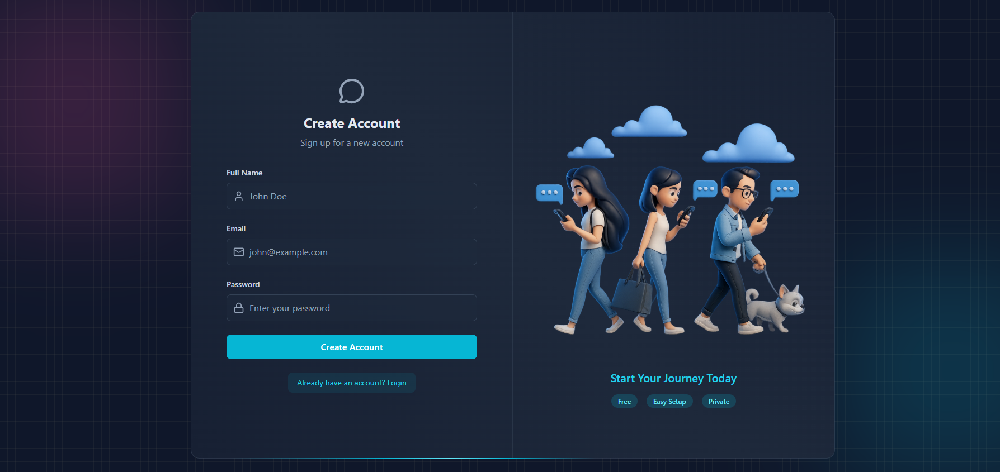
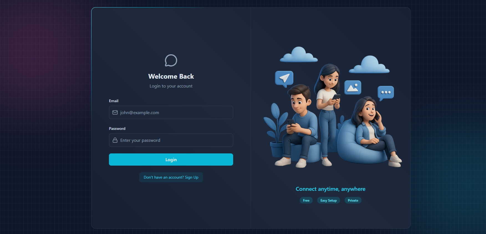
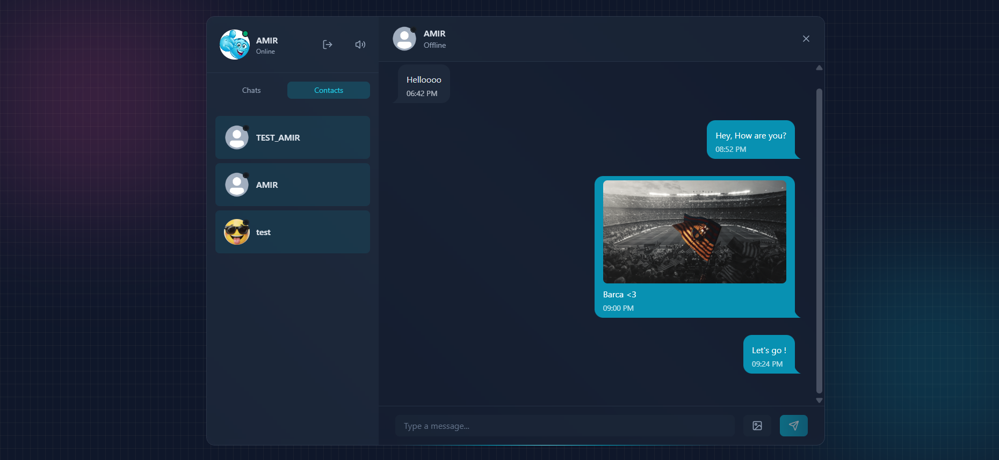
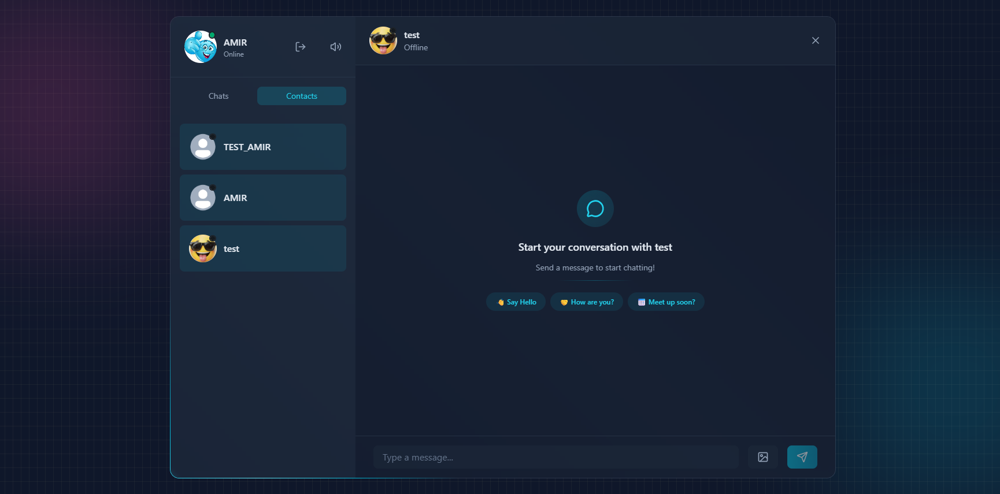

# 💬 Chatify – Real-Time Chat Application

A full-stack real-time chat application built with the MERN stack, featuring instant messaging, online presence detection, image sharing, and secure authentication.

---

## ✨ Features

- 🔐 **JWT Authentication** — Secure signup, login, and logout with HTTP-only cookies
- ⚡ **Real-time Messaging** — Instant message delivery powered by Socket.io
- 🟢 **Online Presence** — See which users are currently online
- 🖼️ **Image Sharing** — Send images in chat with Cloudinary storage
- 👤 **Profile Management** — Update profile picture with live preview
- 🔔 **Sound Effects** — Keyboard typing sounds and message notification sounds
- 🛡️ **Rate Limiting & Bot Protection** — Powered by Arcjet
- 📧 **Welcome Emails** — Automated onboarding emails via Resend
- 🌙 **Dark Theme** — Sleek dark UI with animated gradient border

---

## 📸 Screenshots

| Sign Up | Login Page |
|--------|-----------|
|  |  |

| Chat |  
|-------------|---------|
|  |  |

## 🛠️ Tech Stack

### Frontend
| Technology | Purpose |
|-----------|---------|
| React 18 | UI Framework |
| Zustand | State Management |
| Socket.io Client | Real-time Communication |
| Axios | HTTP Requests |
| Tailwind CSS + DaisyUI | Styling |
| React Hot Toast | Notifications |
| Lucide React | Icons |

### Backend
| Technology | Purpose |
|-----------|---------|
| Node.js + Express | Server Framework |
| MongoDB + Mongoose | Database |
| Socket.io | WebSocket Server |
| JWT | Authentication |
| Bcrypt.js | Password Hashing |
| Cloudinary | Image Storage |
| Resend | Email Service |
| Arcjet | Security & Rate Limiting |

# ⚙️ Getting Started

### Prerequisites
- Node.js v18+
- MongoDB Atlas account
- Cloudinary account
- Resend account
- Arcjet account

#Installation
-git clone https://github.com/your-username/chatify.git 
-cd chatify
-npm install 
-cd frontend && npm install
-cd ../backend && npm install
# run servers cd backend && npm run dev cd frontend && npm run dev
# before running the app, create backend/.env:
-MONGO_URI=...
-JWT_SECRET=...

## 📬 Contact
- Email: amirayman555@email.com

⭐ If you found this project helpful, please give it a star!

